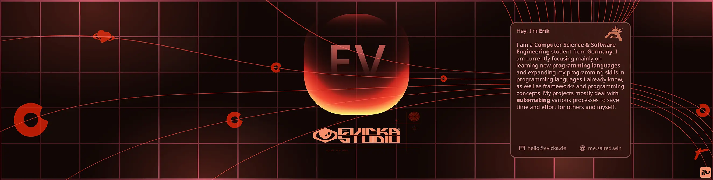
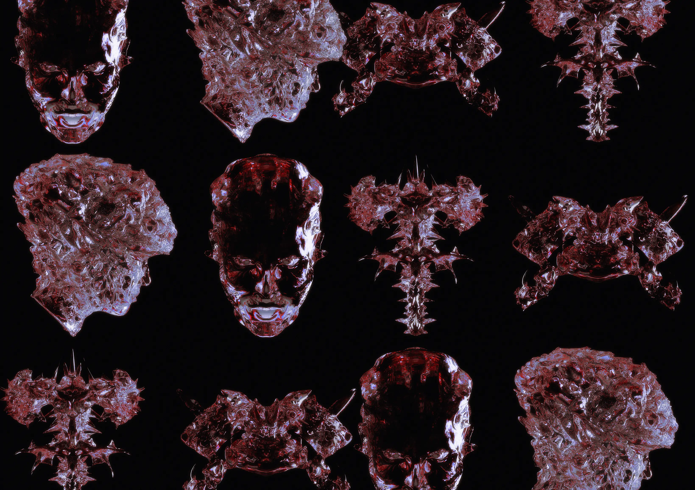

  

<h2 align="center">EvickaStudio — Welcome to my profile</h2>

  
  <!-- Centering reference: using container alignment per CSS text-align guidance -->

  

<h3>Hey, I'm Erik</h3>

  I am a <strong>Computer Science & Software Engineering</strong> student from
  Germany. I am currently focusing mainly on learning new programming
  languages and expanding my programming skills in programming languages I
  already know, as well as frameworks and programming concepts. My projects
  mostly deal with automating various processes to save time and effort for
  others and myself.

  An example of this is MoodleMate, a Python program that uses a
  self-written Moodle REST API wrapper to retrieve notifications from most
  Moodle learning platforms and forward them to various notification
  services such as Discord to have all the information at a certain point
  so that you don't lose track. MoodleMate is one of the projects I've been
  working on the longest, as I keep coming up with better ways to improve
  communication and other aspects, from several codebase restructurings to
  containerizing the project into a simple docker container so that the
  program works properly on all instances.

  I am also very familiar with graphics and some 3D design, so I like to
  create new design concepts for my projects, logos, design websites or try
  to get involved creatively in other places.

 

  

---

## Technologies

| **Category**          | **Technologies**                                                                                                 |
|-----------------------|------------------------------------------------------------------------------------------------------------------|
| **Programming**       | `Python`, `Java`,`Rust`                                                                                           |
| **Databases**         | `SQL (MySQL, SQLite, MariaDB)`                                                                                   |
| **IDEs**              | `JetBrains (IntelliJ)`, `VS Code`, `Zed`                                                                         |
| **Operating Systems** | `Linux (EndeavourOS, CachyOS, Debian, Ubuntu)`, `Windows`                                                        |
| **Design Tools**      | `Figma`, `Photoshop`, `Illustrator`, `Gimp`                                                                      |
| **3D Tools**          | `Blender`, `ZBrush`                                                                                              |
| **Other**             | `Git`, `Docker`, `Kubernetes`                                                                                                 |

---

## 📈 Metrics

<table>
  <tr>
    <td align="center">
      
    </td>
    <td align="center">
      
    </td>
  </tr>
  <tr>
    <td align="center">
      
    </td>
    <td align="center">
      
    </td>
  </tr>
</table>

---

## 🎧 Spotify

<!-- SPOTIFY-START -->

### 🟢 Now Playing

**🎵 [Wenn es passiert](https://open.spotify.com/track/0tqdwcXyp9EytUIsR46OBw)**
*by* **Wir sind Helden**
*Album:* Von hier an blind

<svg width="300" height="20" xmlns="http://www.w3.org/2000/svg">
    <rect width="300" height="4" fill="#282828" rx="2"/>
    <rect width="75" height="4" fill="#1db954" rx="2"/>
    <circle cx="75" cy="2" r="6" fill="#1db954"/>
</svg>
 

    0:53 • 3:32

### 📜 Recently Played

🎤 **[Shut My Eyes](https://open.spotify.com/track/4DFfhrxIcDmdGco2uj1qSW)** by **Burrrn** *(Blaze Down His Way Like the Space Show)*
🎤 **[angelz den](https://open.spotify.com/track/2LK9vpASV1qXqoGKT0IbFr)** by **KidSnorlax, 6arelyhuman** *(angelz den)*
🎤 **[Ga Weg](https://open.spotify.com/track/47kPXoau0VGVWHiZfGinXh)** by **Desinteresse** *(Ga Weg)*
🎤 **[when you sleep](https://open.spotify.com/track/2KylN9C0wNbzLgZNTG9oiU)** by **my bloody valentine** *(loveless)*
🎤 **[I Heard a Sigh](https://open.spotify.com/track/4O4RFEWff8GeQwypae0ibM)** by **Cortex** *(Inedit 79)*

### 🌟 Top Artists *(Short Term)*

🥇 [**The Smiths**](https://open.spotify.com/artist/3yY2gUcIsjMr8hjo51PoJ8)
🥈 [**archive computer**](https://open.spotify.com/artist/2uctHdevYe0jrnr6RvmkBh)
🥉 [**Levi Ryan**](https://open.spotify.com/artist/00hxNB9gMEeMFLLaW06F4J)
🏅 [**Bladee**](https://open.spotify.com/artist/2xvtxDNInKDV4AvGmjw6d1)
🏅 [**Snow Strippers**](https://open.spotify.com/artist/6TsAG8Ve1icEC8ydeHm3C8)

### 🎶 Top Tracks *(Short Term)*

🥇 [**sur la piste**](https://open.spotify.com/track/3aOZh3uCF7ZCW4HvAAR7OO)
🥈 [**Myth**](https://open.spotify.com/track/5bNrxsBY7GaovXZ8gfbLfn)
🥉 [**ABSTURZ**](https://open.spotify.com/track/1fNTmaOeKOS5Qgl1n3ENhW)
🏅 [**if u wanna go with me**](https://open.spotify.com/track/6BAL15TjwIuxZoiTcTvn4b)
🏅 [**It wont stop raining here**](https://open.spotify.com/track/3UFqAJzlerXb1QmZVKpHIX)

🕐 Last updated: 2026-02-13 19:29:08Z UTC
<!-- SPOTIFY-END -->
