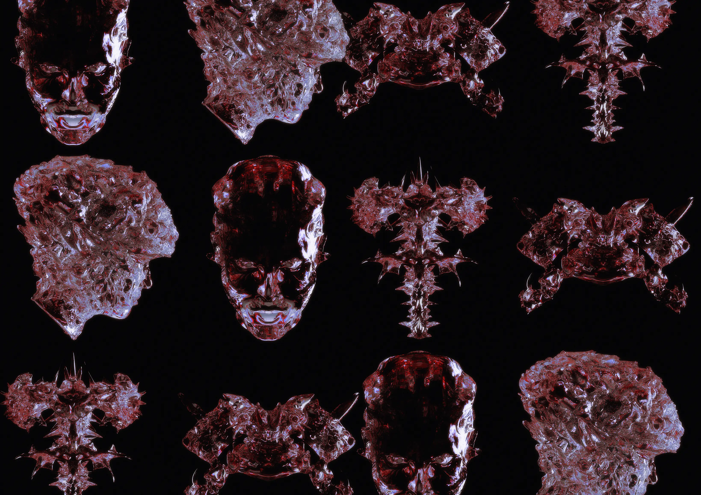

  

Hey, I'm Erik

  I am a **Computer Science & Software Engineering** student from Germany. I am currently focusing mainly on learning new programming languages and expanding my programming skills in programming languages I already know, as well as frameworks and programming concepts. My projects mostly deal with automating various processes to save time and effort for others and myself.

An example of this is MoodleMate, a Python program that uses a self-written Moodle REST API wrapper to retrieve notifications from most Moodle learning platforms and forward them to various notification services such as Discord to have all the information at a certain point so that you don't lose track. MoodleMate is one of the projects I've been working on the longest, as I keep coming up with better ways to improve communication and other aspects, from several codebase restructurings to containerizing the project into a simple docker container so that the program works properly on all instances.

I am also very familiar with graphics and some 3D design, so I like to create new design concepts for my projects, logos, design websites or try to get involved creatively in other places.

 

---

---

## ⚡️ A Few Quick Facts

  

- 🔬 Currently focusing on new coding paradigms and design workflows  
- 👀 I enjoy working with GUIs, graphics, and some 3D modeling  
- 🌱 Learning about advanced DevOps principles and containerization  

 

---

## 🛠️ Skills & Technologies

| **Category**          | **Technologies**                                                                                                 |
|-----------------------|------------------------------------------------------------------------------------------------------------------|
| **Programming**       | `Python`, `Java`,`Rust`                                                                                           |
| **Databases**         | `SQL (MySQL, SQLite, MariaDB)`                                                                                   |
| **IDEs**              | `JetBrains (IntelliJ)`, `VS Code`, `Zed`                                                                         |
| **Operating Systems** | `Linux (EndeavourOS, CachyOS, Debian, Ubuntu)`, `Windows`                                                        |
| **Design Tools**      | `Figma`, `Photoshop`, `Illustrator`, `Gimp`                                                                      |
| **3D Tools**          | `Blender`, `ZBrush`                                                                                              |
| **Other**             | `Git`, `Docker`                                                                                                  |

---

## 📊 GitHub Stats

  
  

---

## 🔝 Top Languages

  

---

## 🕔 WakaTime Stats

  

 ---

## 🎧 Spotify

<!-- SPOTIFY-START -->
### 🟢 Now Playing
Not playing anything right now.

### 📜 Recently Played
- **[esc](https://open.spotify.com/track/7LofEgI87DMv9J8pycmkhi)** by dreamcache (esc)
- **[Easy Lovers - Alternate Take](https://open.spotify.com/track/17wn00VCpnwY2GVIiLyXdD)** by Piero Piccioni (Camille 2000 (Original Motion Picture Soundtrack))
- **[Swingin' Spathiphyllums](https://open.spotify.com/track/4BhNfgW04FWCSgY0YKdQCG)** by Mort Garson (Mother Earth's Plantasia)
- **[ザ・ワード II](https://open.spotify.com/track/3OCxOUUH3FUf8xk0RuWADJ)** by セキトオ・シゲオ (華麗なるエレクトーン -ザ・ワード-)
- **[Efficace Swing](https://open.spotify.com/track/4RduagyN6mPKY5h81Gzb8P)** by Cortex (Cortex, Vol. 2)

_Last updated: 2025-05-30 17:29:33Z UTC_
<!-- SPOTIFY-END -->