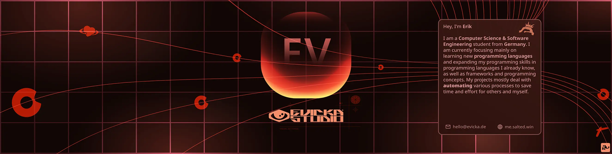
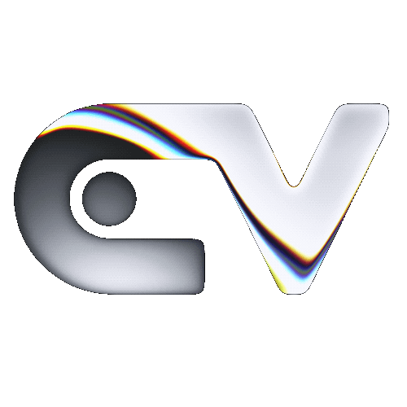
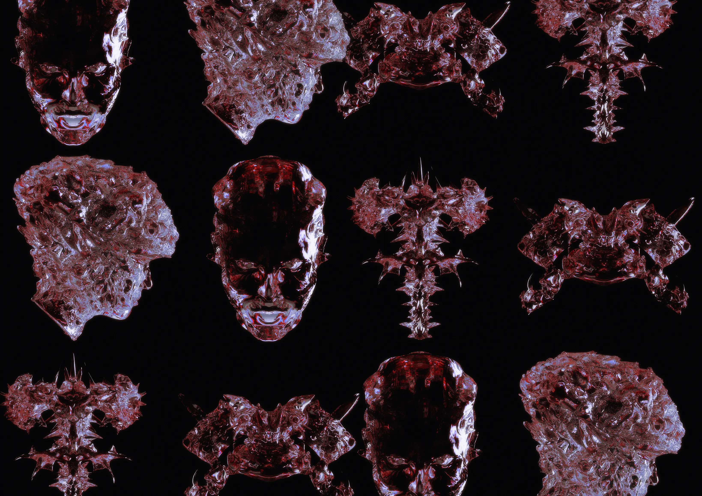

  

<h2 align="center">EvickaStudio — Welcome to my profile</h2>

  
  <!-- Centering reference: using container alignment per CSS text-align guidance -->

  

<h3>Hey, I'm Erik</h3>

  I am a <strong>Computer Science & Software Engineering</strong> student from
  Germany. I am currently focusing mainly on learning new programming
  languages and expanding my programming skills in programming languages I
  already know, as well as frameworks and programming concepts. My projects
  mostly deal with automating various processes to save time and effort for
  others and myself.

  An example of this is MoodleMate, a Python program that uses a
  self-written Moodle REST API wrapper to retrieve notifications from most
  Moodle learning platforms and forward them to various notification
  services such as Discord to have all the information at a certain point
  so that you don't lose track. MoodleMate is one of the projects I've been
  working on the longest, as I keep coming up with better ways to improve
  communication and other aspects, from several codebase restructurings to
  containerizing the project into a simple docker container so that the
  program works properly on all instances.

  I am also very familiar with graphics and some 3D design, so I like to
  create new design concepts for my projects, logos, design websites or try
  to get involved creatively in other places.

 

  

---

## Technologies

| **Category**          | **Technologies**                                                                                                 |
|-----------------------|------------------------------------------------------------------------------------------------------------------|
| **Programming**       | `Python`, `Java`,`Rust`                                                                                           |
| **Databases**         | `SQL (MySQL, SQLite, MariaDB)`                                                                                   |
| **IDEs**              | `JetBrains (IntelliJ)`, `VS Code`, `Zed`                                                                         |
| **Operating Systems** | `Linux (EndeavourOS, CachyOS, Debian, Ubuntu)`, `Windows`                                                        |
| **Design Tools**      | `Figma`, `Photoshop`, `Illustrator`, `Gimp`                                                                      |
| **3D Tools**          | `Blender`, `ZBrush`                                                                                              |
| **Other**             | `Git`, `Docker`, `Kubernetes`                                                                                                 |

---

## 📈 Metrics

<table>
  <tr>
    <td align="center">
      
    </td>
    <td align="center">
      
    </td>
  </tr>
  <tr>
    <td align="center">
      
    </td>
    <td align="center">
      
    </td>
  </tr>
</table>

---

## 🎧 Spotify

<!-- SPOTIFY-START -->
###  Spotify

###  Now Playing

> *Not playing anything right now.*

###  Recently Played

- **[oh yeah?](https://open.spotify.com/track/22NHkFYbgxB2Zirj29Gbp8)** by **Steve Lacy** *(Oh yeah?)* - `2 h ago`
- **[Inundauswendig](https://open.spotify.com/track/1DOVkuzAdnyHgDJXbp92Wq)** by **makko, The Chainsmokers** *(Inundauswendig)* - `2 h ago`
- **[Curls](https://open.spotify.com/track/3bylizl2h9xMjnP8fRKrdz)** by **Bibio** *(Ribbons)* - `2 h ago`
- **[Window](https://open.spotify.com/track/5lLAenT4RjwShN3kJyUq6R)** by **The Album Leaf** *(In A Safe Place)* - `2 h ago`
- **[Green Green Grass Of Tunnel](https://open.spotify.com/track/4cwCN5oe8NtPb1orgeyMWM)** by **múm** *(Finally We Are No One)* - `2 h ago`

###  Top Artists *(Short Term)*

-  **#1** [**Die drei ???**](https://open.spotify.com/artist/3meJIgRw7YleJrmbpbJK6S)
-  **#2** [**Tigers Jaw**](https://open.spotify.com/artist/0tLaqkKW7K6tc3QF9SM0M8)
-  **#3** [**Parannoul**](https://open.spotify.com/artist/7eZbNxarrTW4VkRI8u9aDX)
-  **#4** [**Sigur Rós**](https://open.spotify.com/artist/6UUrUCIZtQeOf8tC0WuzRy)
-  **#5** [**meat computer**](https://open.spotify.com/artist/7JU13ATc2v3kzIuSqNNPWN)

###  Top Tracks *(Short Term)*

-  **#1** [**Safe Place**](https://open.spotify.com/track/1agCLz4usodxdtEGCkBz6D)
-  **#2** [**SAS**](https://open.spotify.com/track/2brzuvLzS2VyBLjg95SzhJ)
-  **#3** [**Robotboy**](https://open.spotify.com/track/6PWnQJBllwdvZx1uVXLUr9)
-  **#4** [**Safe In Your Skin / Where Am I?**](https://open.spotify.com/track/09itu2ev1hcIzDBwgC6vjx)
-  **#5** [**Coming Around**](https://open.spotify.com/track/0qRcdBmhkjZsuWhQevzKD9)

 *Last updated: 2026-08-25 09:31:33 UTC*
<!-- SPOTIFY-END -->
